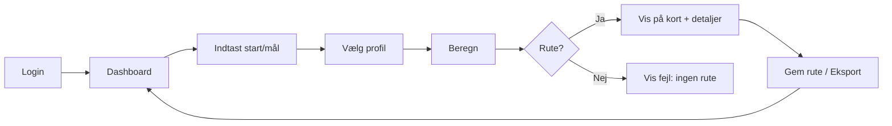

# Wireframes (tekst og flow)

## Plan Rute – flow (Mermaid)

## Skærmopbygning (tekst)

### Dashboard / Plan Rute
- **Top:** Header med logo, bruger, log ud.
- **Under:** To kolonner (eller stacked på mobil):
  - Venstre: Formular – Startadresse (søgefelt med autocomplete), Måladresse, Vælg køretøjsprofil (dropdown), knap "Beregn rute". Evt. "Via"-punkter (valgfri).
  - Under formular eller til side: Kort (MapLibre, fuld bredde eller 60%). Under kort: afstand, kørselstid; knapper "Gem rute", "Eksport GPX", "Eksport PDF".
- **Nederst på kort:** Attribution "© OpenStreetMap contributors". Evt. disclaimer under rute-resultat.

### Køretøjsprofiler
- Tabel: Navn, Længde, Bredde, Højde, Vægt, Aksler, Farligt gods, Handlinger (Rediger, Slet).
- Over tabellen: knap "Ny profil". Modal eller inline formular: felter som i API (VehicleProfileInput); Gem / Annuller.

### Gemte ruter
- Liste eller tabel: Navn, Destination (eller start→mål), Dato, Afstand, Handlinger (Åbn, Eksport, Slet).
- Tom state: "Ingen gemte ruter. Beregn en rute og gem den fra dashboard."

### Gemte steder
- Liste: Navn, Adresse, Handlinger (Slet).
- Tom state: "Ingen gemte steder."

## Interaktionsflow

- Ved "Beregn": loading state; ved success opdateres kort og detaljer; ved 404/fejl vises fejldialog.
- Ved "Gem rute": modal med navn; POST /saved-routes; success → luk og evt. redirect til gemte ruter.
- Eksport: POST /exports → polling GET /exports/{jobId} indtil completed; vis download-link.

Ingen visuelle kopier af tredjepartsprodukter; kun funktionel beskrivelse.
